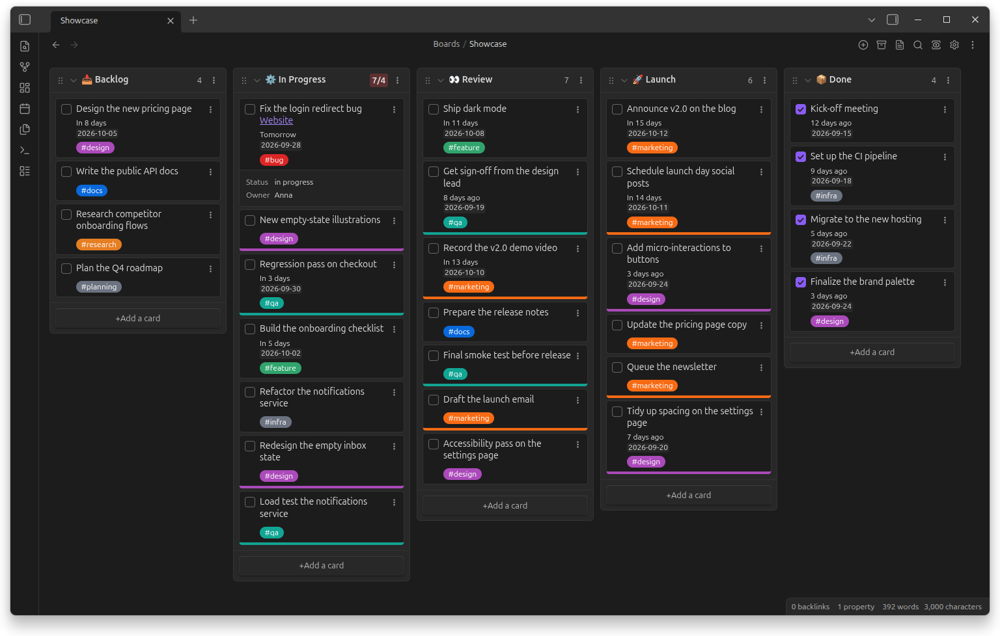

# Kanban Starlane

[](LICENSE.md)
[](https://obsidian.md)
[](https://github.com/TfTHacker/obsidian42-brat)

Markdown-backed Kanban boards for [Obsidian](https://obsidian.md).

Kanban Starlane is a maintained continuation of the
[Kanban plugin](https://github.com/mgmeyers/obsidian-kanban) by Matthew Meyers, whose
development has stopped. Boards stay plain markdown notes: lanes are headings, cards are
task-list items, so your data is readable and editable without the plugin.



## Features

- Boards, lists and tables backed by a markdown note
- Drag and drop cards between lanes and between boards
- **Linked lanes**: a lane can also show the cards of lanes on other boards — keep one board
  per area (work, personal, …) and still see everything together; each board's cards carry
  its color ([how it works](docs/user-guide/guide/linked-lists.md))
- Dates, times, tags, WIP limits, "Complete" lanes and an archive
- Links to notes with their metadata shown on cards; Tasks and Dataview inline fields
- Per-board and global settings

## Installation

Kanban Starlane is not in the community plugin store yet.

- **BRAT**: install [Obsidian42 - BRAT](https://github.com/TfTHacker/obsidian42-brat) and add
  this repository as a beta plugin.
- **Manually**: download `main.js`, `manifest.json` and `styles.css` from the latest release into
  `<your vault>/.obsidian/plugins/kanban-starlane/`, then enable _Kanban Starlane_ in
  _Settings → Community plugins_.

Requires Obsidian 1.6.2 or newer.

## Coming from the Kanban plugin

Kanban Starlane can be installed next to the original plugin; it does not open the original's
boards until you convert them. Open the command palette and run:

- **Convert all boards from the Kanban plugin** — converts every board in the vault, or
  **Convert board from the Kanban plugin** for the current note;
- **Import settings from the Kanban plugin** — copies your global settings.

Conversion changes only the plugin identifiers in each file (`kanban-plugin` →
`kanban-starlane`); lanes, cards, archive and board settings are kept. After converting,
disable the original plugin.

## Documentation

- User guide: [community-archive.github.io/obsidian-kanban](https://community-archive.github.io/obsidian-kanban/)
  (source: [docs/user-guide](docs/user-guide/index.md))
- Changes: [CHANGELOG.md](CHANGELOG.md)

## Development

```bash
npm install
npm run dev        # watch build, installs into test-vault/ — open that folder as a vault
npm run check      # typecheck, lint, format check, unit tests
npm run test:e2e   # end-to-end tests in real Obsidian
```

Start with [AGENTS.md](AGENTS.md) (conventions and workflow — for humans and AI agents alike)
and [docs/dev/](docs/dev/architecture.md) (architecture, board format, testing, decisions).

## Credits and license

Copyright (C) 2021–2024 Matthew Meyers — original Kanban plugin
([his note on the project's history](docs/history/original-maintainers-note.md)).
Copyright (C) 2026 Anton Kremenetsky — Kanban Starlane modifications (see [CHANGELOG.md](CHANGELOG.md)).

Licensed under the [GNU General Public License v3.0](LICENSE.md). Bundled third-party code
keeps its own license: flatpickr (MIT), parts of Dataview and Tasks (MIT),
Hot Reload in the test vault (ISC).
