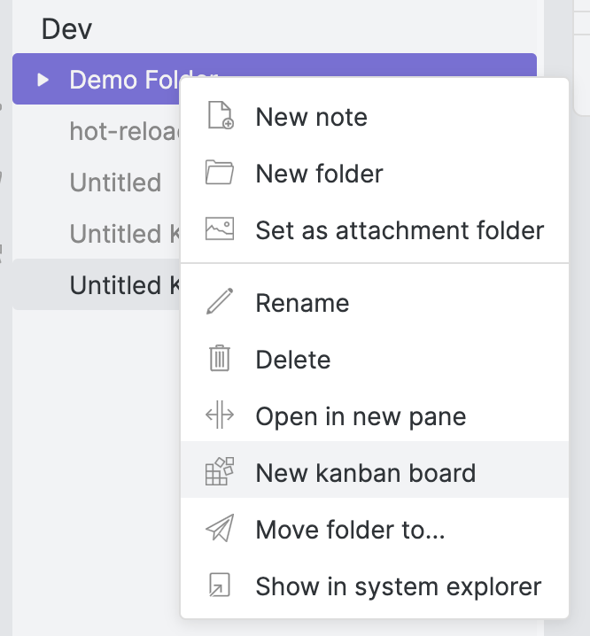
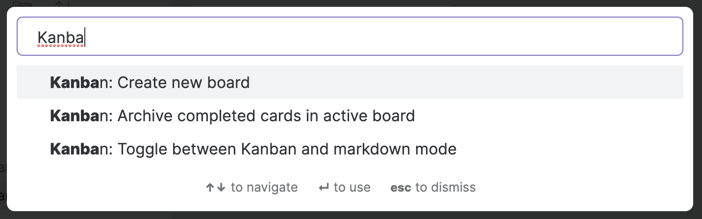
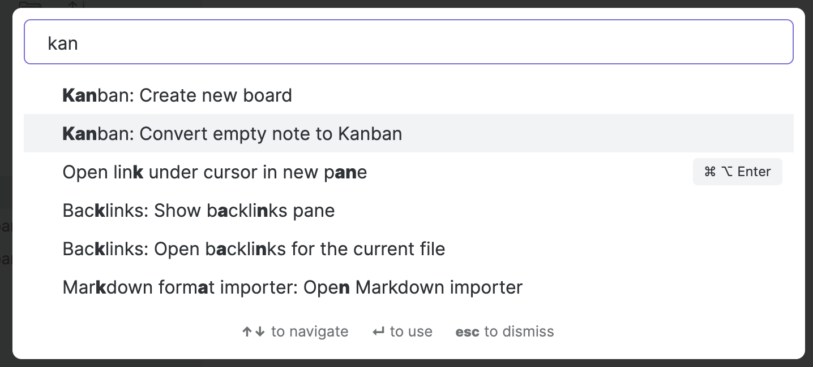

# Creating a board

There are three ways to create a new board:

**Right-click a folder** in the file explorer and choose **New Kanban board**.



**Run the command palette command** `Create new board`. This creates a board at the root of
your vault.



**Convert an empty note** with the command palette command `Convert empty note to Kanban`.



## What a board looks like on disk

A board is a plain markdown note. Each `##` heading is a list, and each task-list item under it
is a card:

```markdown
---
kanban-starlane: board
---

## To do

- [ ] Write the quarterly report
- [ ] Call the plumber

## Done

- [x] Buy groceries
```

You can edit this file directly — in Obsidian's editor or any other text editor — and the board
picks up the change. See [Views](../guide/views.md) for switching between the board, table, list
and markdown views.
