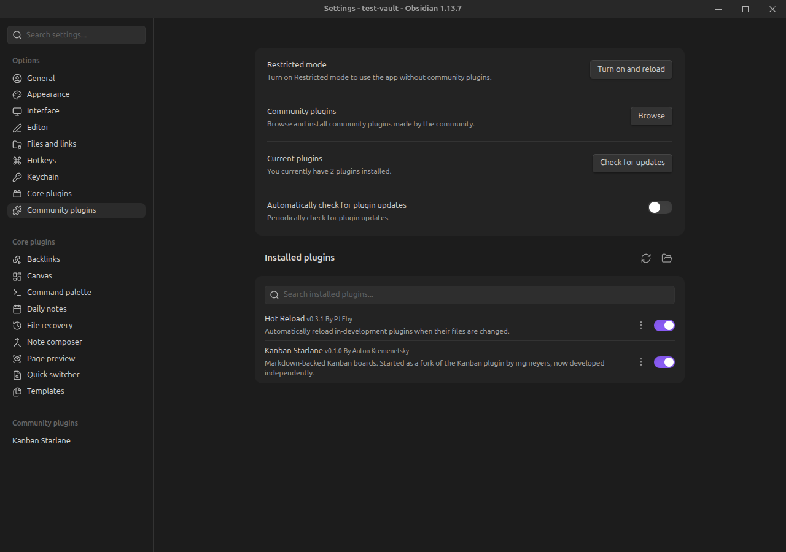

# Installation

Kanban Starlane is in Obsidian's community plugin store. You can also install it with BRAT or by
hand.

## Community plugins (recommended)

1. Open **Settings → Community plugins** and turn off *Restricted mode* if it is on.
2. Click **Browse**, search for **Kanban Starlane**, then **Install** and **Enable**.

Obsidian updates the plugin together with your other community plugins. The
[plugin page](https://community.obsidian.md/plugins/kanban-starlane) lists the releases.

## BRAT

Use BRAT to try versions before they reach the store.

1. Install [Obsidian42 - BRAT](https://github.com/TfTHacker/obsidian42-brat) from the community
   plugin store.
2. In BRAT's settings, add this repository as a beta plugin:
   `akremenetsky/kanban-starlane`.
3. Enable **Kanban Starlane** under **Settings → Community plugins**.

BRAT also keeps the plugin updated automatically.

## Manual install

1. Download `main.js`, `manifest.json` and `styles.css` from the
   [latest release](https://github.com/akremenetsky/kanban-starlane/releases/latest).
2. Copy them into `<your vault>/.obsidian/plugins/kanban-starlane/`.
3. Enable **Kanban Starlane** under **Settings → Community plugins**.

## Requirements

Kanban Starlane requires Obsidian 1.8.7 or newer.

Already using the original Kanban plugin? See
[Coming from the Kanban plugin](migrating-from-kanban-plugin.md) — both plugins can run side by
side until you convert your boards.
