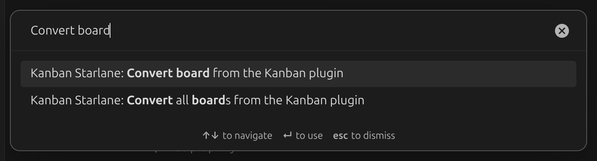

# Coming from the Kanban plugin

Kanban Starlane can be installed next to the original [Kanban
plugin](https://github.com/mgmeyers/obsidian-kanban); it does not open the original's boards
until you convert them.

## Convert your boards

Open the command palette (`Ctrl`/`Cmd` + `P`) and run one of:

- **Convert board from the Kanban plugin** — converts the currently open note.
- **Convert all boards from the Kanban plugin** — converts every board in the vault.

Conversion only changes the plugin identifiers stored in each file: `kanban-plugin` becomes
`kanban-starlane` in the frontmatter, and `%% kanban:settings` becomes
`%% kanban-starlane:settings`. Lists, cards, the archive and board settings are kept as-is.

## Bring your global settings over

Run **Import settings from the Kanban plugin** from the command palette to copy your global
Kanban plugin settings into Kanban Starlane.

## After converting

Disable the original Kanban plugin — a board only opens as a Kanban board in the plugin whose
frontmatter key it currently has, and having both plugins active on the same file can conflict.
