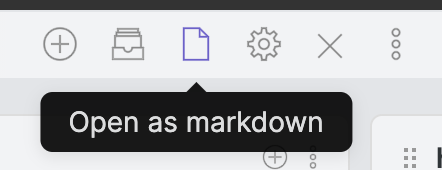
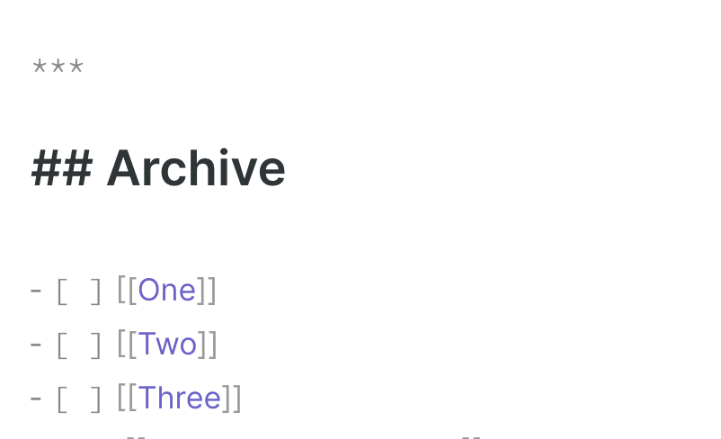

# Archive

Archiving a card removes it from the board without deleting it — `Ctrl`/`Cmd`-clicking a card's
checkbox archives it, as does the **Archive** entry in its `⋮` menu, or **Archive completed
cards** in the board's `⋮` menu (also available as a command palette command).

## Viewing the archive

The archive is only visible in markdown mode. Toggle to it with the command palette command
`Toggle between Kanban and markdown mode`:

Archived cards are listed under an `## Archive` heading at the bottom of the file:

Run `Toggle between Kanban and markdown mode` again to return to the board.

## Archive settings

By default the archive grows without limit. You can cap its size, and control whether archived
cards get a timestamp — see [Archive settings](../settings/archive.md).
