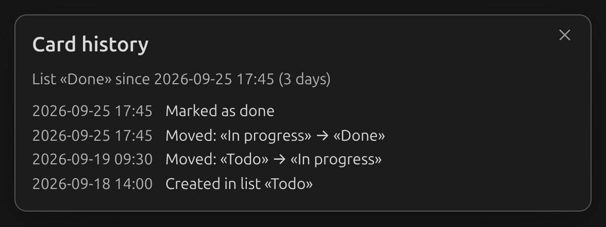

# Card history

Kanban Starlane keeps a history of what happened to each card: when it was created, edited,
moved between lists, checked or unchecked, archived or restored. This also works for cards
shown through [linked lists](linked-lists.md) — their history stays with the card's own board.

## Viewing a card's history

Right-click a card, or open its `⋮` menu, and choose **History**.

The window opens with a summary — how long the card has been in its current list — followed by
every recorded event, newest first:

- **Created in list "…"**
- **Edited**
- **Moved: "From" → "To"** (or **Moved from board "…": "From" → "To"** for a card that came from
  another board through a linked list)
- **Marked as done** / **Marked as not done**
- **Archived from list "…"** / **Restored from archive to list "…"**

Only the *fact* that something happened is recorded, not what changed — for example, an edit
shows as **Edited**, not the new text. Edits made within two minutes of each other count as one
event.

## What's not recorded

- Changes made by editing the board's **markdown** directly are not recorded — only actions
  taken through the plugin's UI are (the plugin can't tell who made a text edit, or when).
- Deleting a card deletes its history along with it. Dragging a card to another board keeps its
  history and moves it there too.

## Turning it off

History is on by default. Turn it off in [settings](../settings/general.md#card-history) if you
don't want cards tracked — this stops recording new events but keeps whatever history a card
already has.
