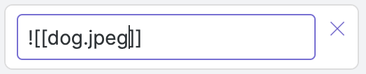
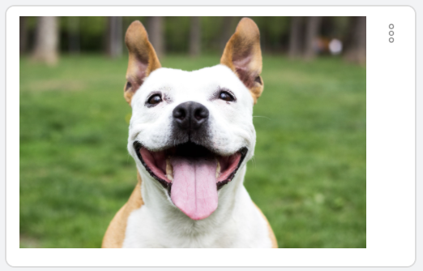
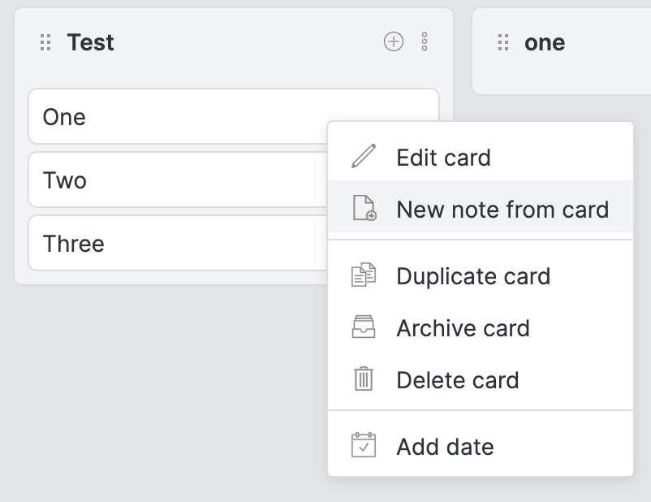
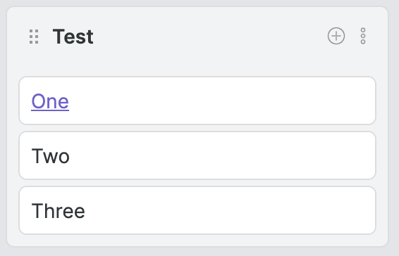
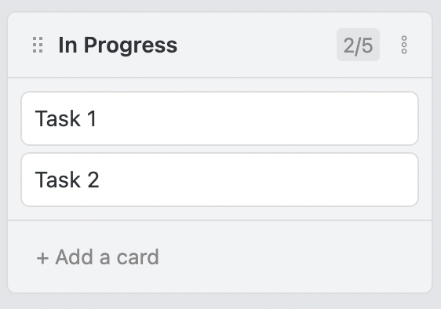
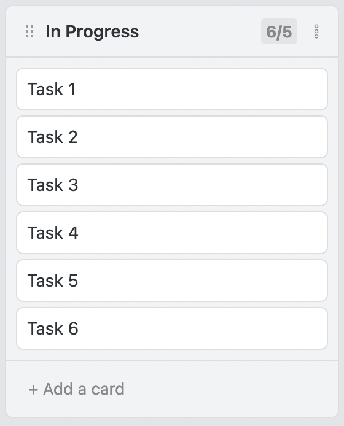
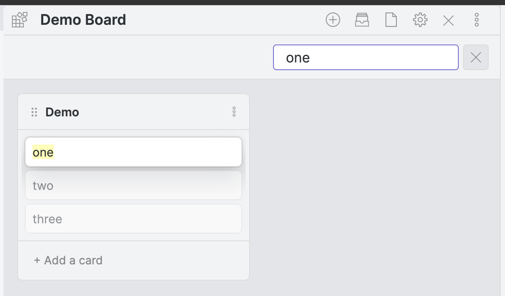

# Cards and lists

## Adding and editing cards

Click **Add a card** at the bottom (or top, depending on your
[insertion setting](../settings/general.md#prepend-append-new-cards)) of a list, or click a
card to edit it in place. By default, `Enter` finishes a card and `Shift+Enter` adds a new line
— this can be swapped in [New line trigger](../settings/general.md#new-line-trigger).

Turn on a checkbox next to each card's title with
[Display card checkbox](../settings/general.md#display-card-checkbox); `Ctrl`/`Cmd`-clicking it
archives the card.

## Embedding images

Images can be embedded in a card just like in any other Obsidian note:

A card can also *display* an image pulled from a linked note's metadata — see
[Linked page metadata](linked-page-metadata.md#displaying-images).

## Creating a note from a card

Right-click a card, or open its `⋮` menu, and choose **New note from card**.

This creates a note in the [note folder](../settings/general.md#note-folder) using the
[note template](../settings/general.md#note-template), titled after the card's text. The card
then links to the new note.

## WIP limits

To cap how many cards a list can hold, put the limit in parentheses after the list's title —
for example, rename **In progress** to `In progress (5)`. The limit shows next to the list's
card count:

Once the list has more cards than the limit, the count is shown in bold:

Rename the list again with a new number (or without one) to change or remove the limit.

## Searching a board

Search a board like any other note — the default hotkey is `Ctrl`/`Cmd` + `F`.

Whether clicking a tag searches the board or the whole vault is controlled by
[Tag click action](../settings/tags.md#tag-click-action).
