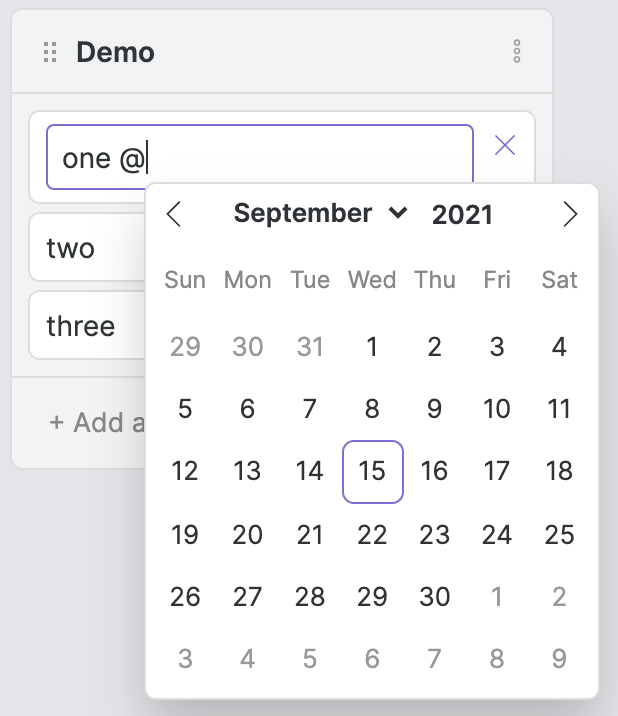
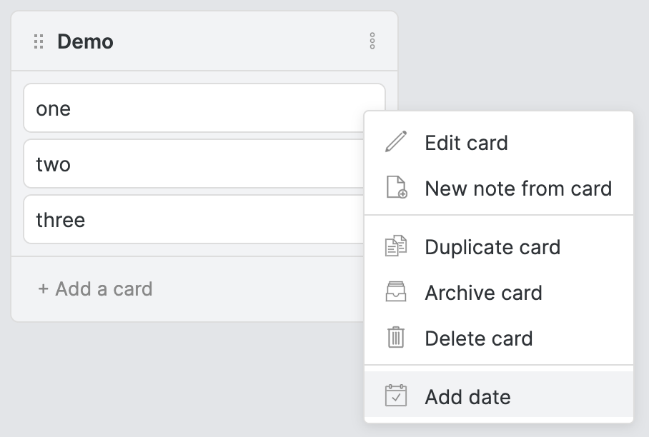
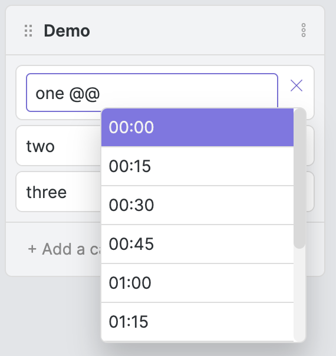
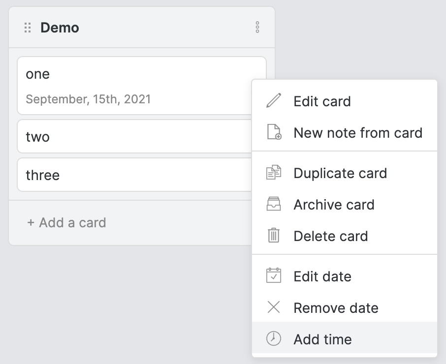

# Dates and times

## Adding a date

Type the [date trigger](../settings/dates-and-time.md#date-trigger) — `@` by default — while
editing a card to open the date picker.

You can also right-click a card, or open its `⋮` menu, and choose **Add date**.

## Adding a time

Type the [time trigger](../settings/dates-and-time.md#time-trigger) — `@@` by default — to open
the time picker.

A card that already has a date can also get a time from its `⋮` menu.

## Formatting and display

- [Date format](../settings/dates-and-time.md#date-format) and
  [Time format](../settings/dates-and-time.md#time-format) control what gets written into the
  card's markdown.
- [Date display format](../settings/dates-and-time.md#date-display-format) controls how the
  date is shown on the card, independently of what's saved to disk.
- Move the date out of the card's body and into its footer with
  [Move dates to card footer](../settings/dates-and-time.md#move-dates-to-card-footer).
- Turn on [Show relative date](../settings/dates-and-time.md#show-relative-date) to show "in 3
  days" or "a month ago" instead of a fixed date.
- Turn on [Link dates to daily notes](../settings/dates-and-time.md#link-dates-to-daily-notes)
  to make a card's date open the matching daily note.
