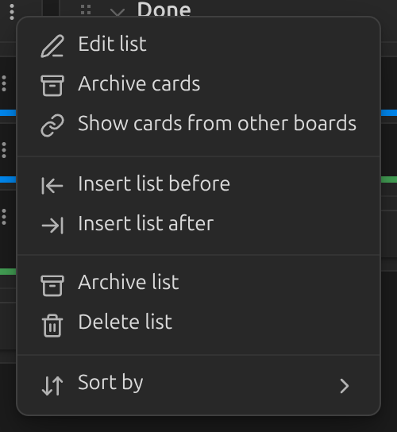
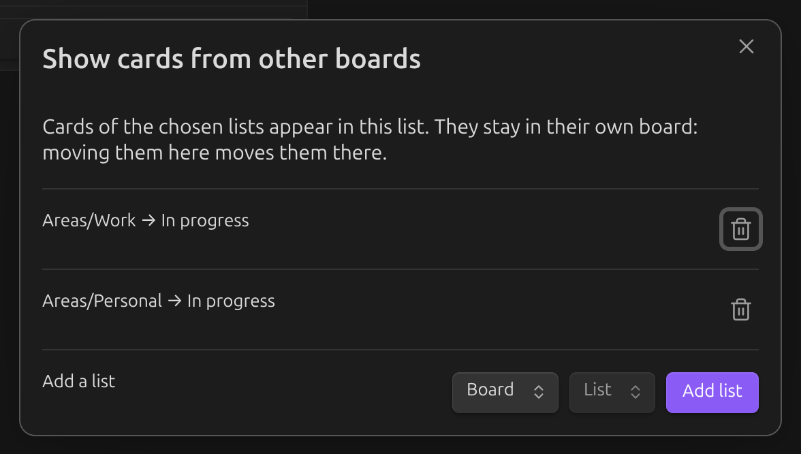
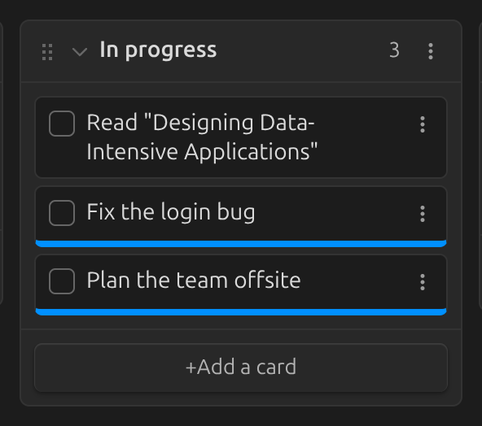

# Linked lists

Keep one board per area of your life (work, personal, study…) and still see them together: a
list can also show the cards of lists on other boards. These are called *linked lists*.

## Link a list

1. Open the list menu (the `⋮` button in the list header) and choose **Show cards from other
   boards**.

   

2. Pick a board and one of its lists, then click **Add list**. Add as many as you like, from
   one or several boards.

   

Cards of the linked lists now appear in this list. Links go one way: the other board does not
change and does not show your cards. To see each other's cards, link the lists on both boards.

A board with empty lists that only link other boards works as an **overview** of everything.

## Telling cards apart

Cards from other boards have a colored stripe at the bottom: the color of their board. Set it
in that board's settings, under [Board color](../settings/board-color.md). The card menu (`⋮`
on the card) starts with **From board: …** — click it to open that board.

## Working with linked cards

A linked card still belongs to its own board. Everything you do with it — check it, edit it,
archive it, drag it — changes that board's file, even when that board is not open.

- **Dragging.** A linked card can go to any list that shows the same board, and it moves to
  the matching list there. Lists that do not show its board don't accept it.
- **Order.** Put cards of all boards in any order. The other board only changes when its own
  cards change order among themselves or move to another list.
- **New cards** added to a list always belong to the board you are looking at.

## Good to know

- Linked cards are shown on boards, not in the table view.
- Renaming or moving a board, or renaming a list through the plugin, keeps links working. If a
  linked board or list can't be found (for example, renamed in markdown), the list shows
  *Linked list not found*; link it again from the list menu.
- To remember where a linked card sits, the plugin may add a block id (like `^k3f9a2`) to it
  in its own file. Boards never show it.
