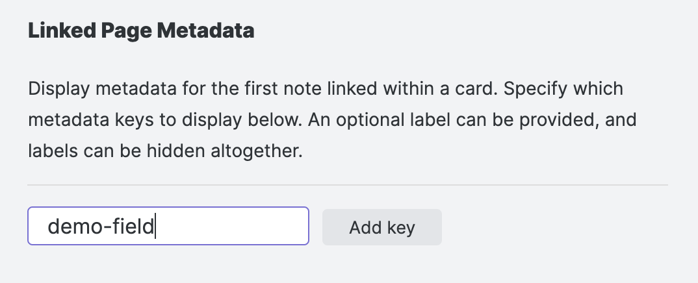
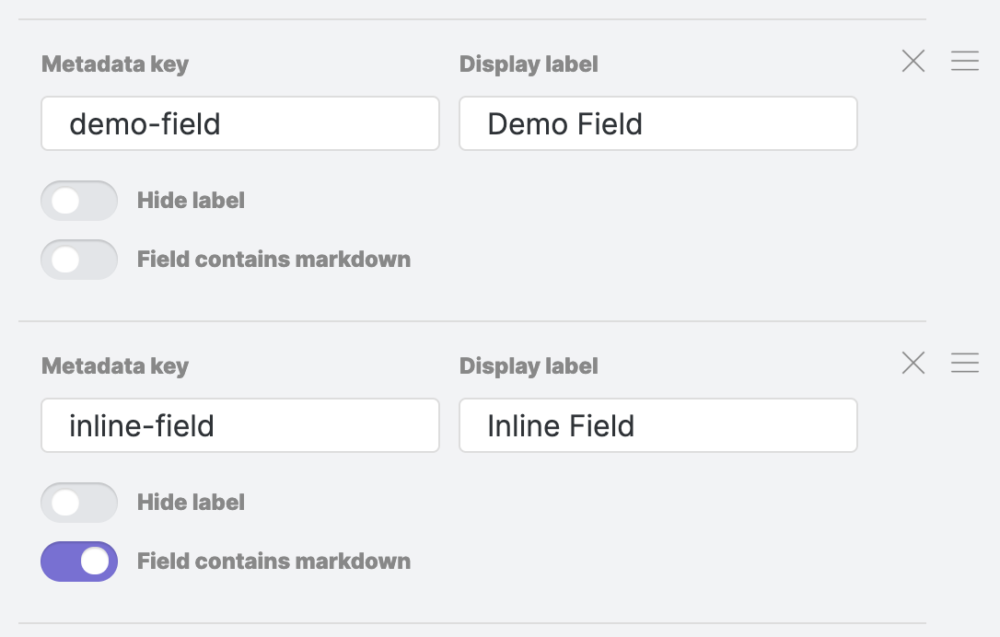
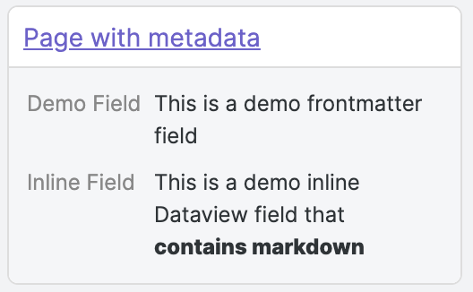
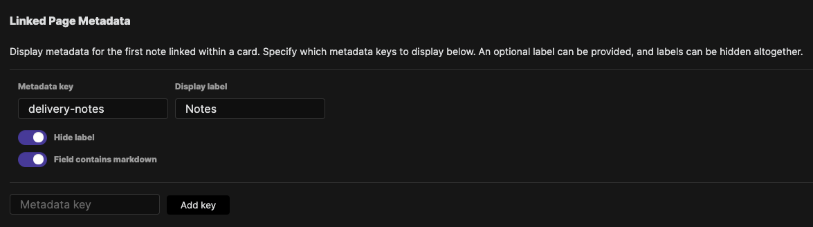
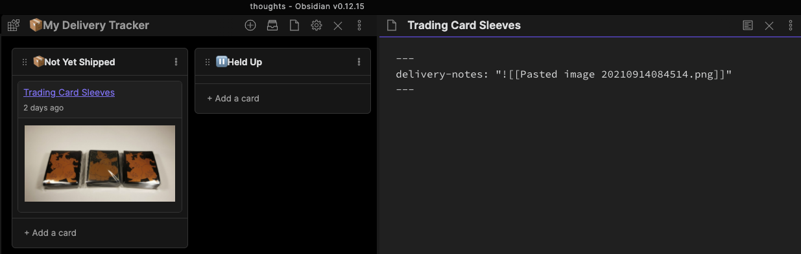

# Linked page metadata

A card that links to a note can show that note's [frontmatter](https://help.obsidian.md/Advanced+topics/YAML+front+matter)
and [Dataview](https://blacksmithgu.github.io/obsidian-dataview/data-annotation/) fields below
it. Only the first link or embed in the card is used.

Say a linked note contains:

```markdown
---
demo-field: This is a demo frontmatter field
---

Lorem ipsum dolor sit amet, consectetur adipiscing elit.

inline-field:: This is a demo inline Dataview field that **contains markdown**
```

Add `demo-field` and `inline-field` under
[Linked page metadata](../settings/linked-page-metadata.md) in the settings, and they appear
below the card:



If a field contains markdown (like the bold text above), toggle **Field contains markdown** for
that key, or it will be shown as plain text:




## Displaying images

The same mechanism can show an image: point a metadata key at a field that contains an image
embed.



!!! warning "Frontmatter needs quotes"
    An image embed in **frontmatter** must be wrapped in quotes, or Obsidian's YAML parser
    won't accept it:

    ```yaml
    ---
    delivery-notes: "![[LinkToImage.png]]"
    ---
    ```

    In **inline** Dataview fields (`delivery-notes:: ![[LinkToImage.png]]`), quotes are not
    needed. See [FAQ: frontmatter limitations](../faq.md) for more of these quirks.


