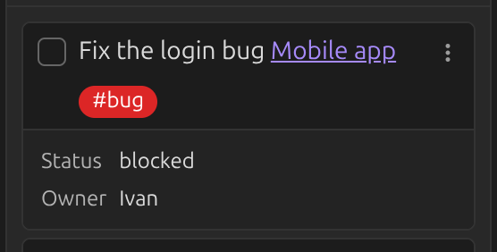

# Tags

Write `#tags` anywhere in a card's text and they're picked up like anywhere else in Obsidian —
they show up in Obsidian's tag search and pane too.

By default, tags stay in the card's body and clicking one searches the whole vault. You can:

- Move tags to the card's footer instead of the body —
  [Move tags to card footer](../settings/tags.md#move-tags-to-card-footer).
- Make clicking a tag search the board instead of the vault —
  [Tag click action](../settings/tags.md#tag-click-action).
- Give specific tags a color, or control how lists are sorted by tag —
  see [Tags settings](../settings/tags.md).
