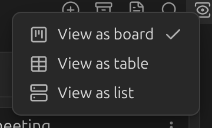
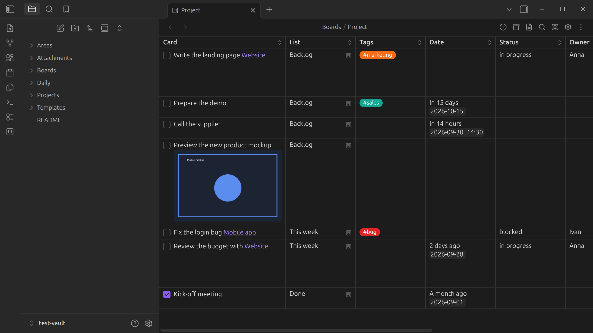
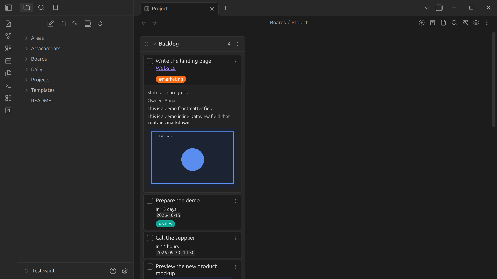

# Views

A board can be shown in three ways. Switch between them from the **Board view** button in the
board header, or the command palette:

- **View as board** — the classic Kanban layout, lists side by side.
- **View as table** — one row per card, with columns you can sort and filter.
- **View as list** — a flat, vertical list of every list and its cards.

Every board also has its underlying **markdown** — the plain note behind the board. Toggle
between them with the command palette command `Toggle between Kanban and markdown mode`.
Switching to markdown is also how you view a board's [archive](archive.md).

The header buttons shown for each board (add a list, search, board settings, …) can be hidden
individually — see [Board header buttons](../settings/board-header-buttons.md).
