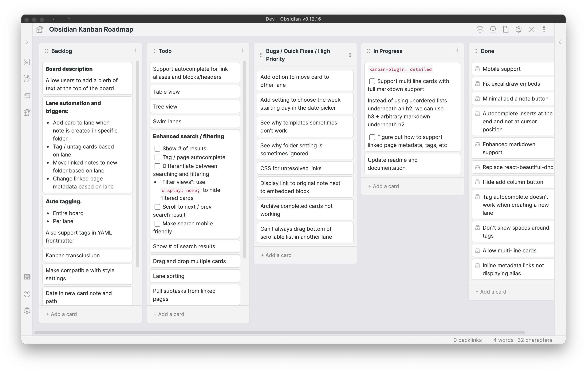

# Kanban Starlane

Kanban Starlane turns markdown notes into Kanban boards inside [Obsidian](https://obsidian.md).
Lists are headings, cards are task-list items — a board stays a plain markdown file that you
can read and edit without the plugin.

Kanban Starlane is a maintained continuation of the
[Kanban plugin](https://github.com/mgmeyers/obsidian-kanban) by Matthew Meyers, whose
development has stopped. It can be installed next to the original plugin and converts its
boards on demand — see [Coming from the Kanban plugin](getting-started/migrating-from-kanban-plugin.md).

## What it does

- Boards, lists and tables backed by a single markdown note.
- Drag and drop cards between lists, and between boards with [linked lists](guide/linked-lists.md).
- Dates, times, tags, [WIP limits](guide/cards-and-lists.md#wip-limits) and an
  [archive](guide/archive.md) for finished cards.
- [Card history](guide/card-history.md): see when a card was created, moved or checked, even
  across boards.
- Cards can link to a note and show its [metadata](guide/linked-page-metadata.md), including
  fields from the Tasks and Dataview plugins.
- Every setting can be set globally or overridden per board — see [Settings](settings/index.md).

## Where to start

- New to Kanban Starlane? Start with [Getting started](getting-started/installation.md).
- Looking for a specific setting? Go to [Settings](settings/index.md).
- Something not working as expected? Check the [FAQ](faq.md).

## Support

Kanban Starlane is free and open source. If you'd like to support the original Kanban plugin
that it continues, you can sponsor [Matthew Meyers](https://github.com/sponsors/mgmeyers) or
buy him a coffee — see the [main repository](https://github.com/mgmeyers/obsidian-kanban) for
links.
