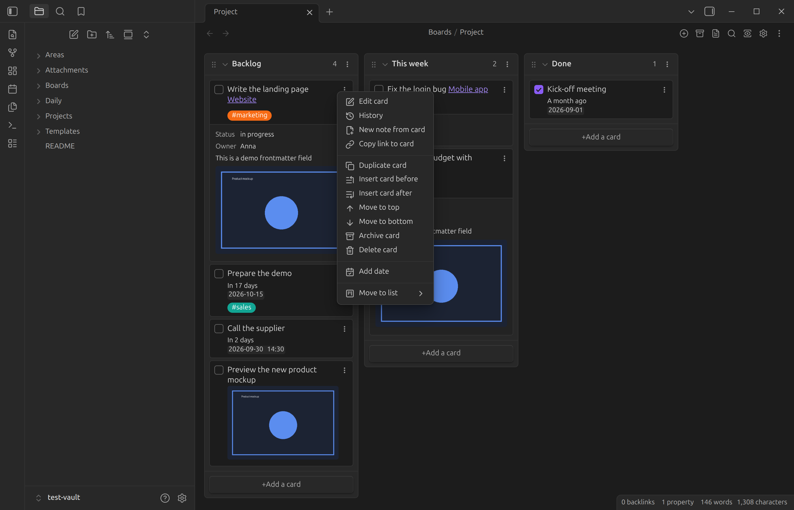

# Kanban Starlane

Kanban boards for [Obsidian](https://obsidian.md), stored as plain markdown notes.

Kanban Starlane turns a note into a board: lists are headings and cards are task-list items, so
the note stays readable and editable without the plugin. Cards carry dates, tags and links to
other notes, move between lists and boards by drag and drop, and keep a history of what happened
to them. One list can also show the cards of lists on other boards, so you can keep a board per
area and still see all your work in one place.

## What it does

- **[Three views](guide/views.md)** of the same note: board, table and list.
- **[Cards and lists](guide/cards-and-lists.md)**: edit cards in place, embed images, turn a card
  into a note, search the board, drag cards between lists and boards.
- **[Linked lists](guide/linked-lists.md)**: a list also shows the cards of lists on other boards;
  each board's cards carry its color, and changes go to that board's file.
- **[Dates and times](guide/dates-and-times.md)** on cards, shown as dates or relative
  ("in 3 days").
- **[Tags](guide/tags.md)** with their own colors.
- **[WIP limits](guide/cards-and-lists.md#wip-limits)** per list.
- **[Card history](guide/card-history.md)**: when a card was created, edited, moved, checked or
  archived, even across boards.
- **[Archive](guide/archive.md)** for finished cards.
- **[Linked page metadata](guide/linked-page-metadata.md)**: a card linking to a note shows that
  note's properties, and [Tasks and Dataview fields](settings/inline-metadata.md) on the card are
  shown too.
- **[Settings](settings/index.md)** set globally or overridden per board.

## Where to start

- New to Kanban Starlane? Start with [Getting started](getting-started/installation.md).
- Using the Kanban plugin already? See
  [Coming from the Kanban plugin](getting-started/migrating-from-kanban-plugin.md): both plugins
  can be installed side by side, and boards are converted on demand.
- Looking for a specific setting? Go to [Settings](settings/index.md).
- Something not working as expected? Check the [FAQ](faq.md).

## About

Kanban Starlane is a fork of the [Kanban plugin](https://github.com/mgmeyers/obsidian-kanban)
2.0.51 by Matthew Meyers. It is developed on its own roadmap.
