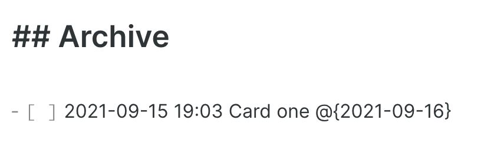
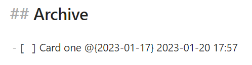
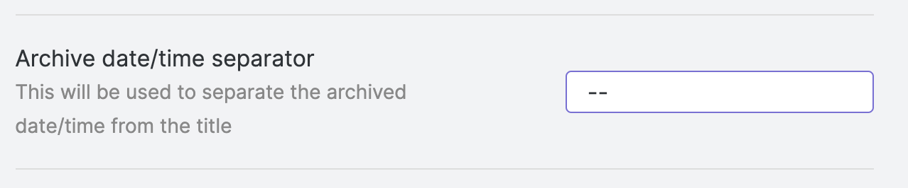
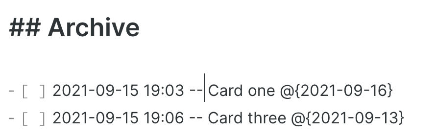
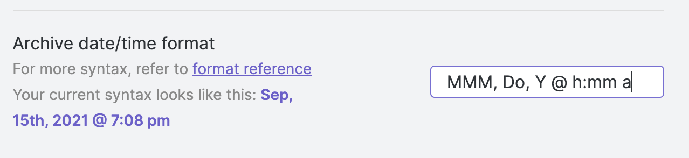
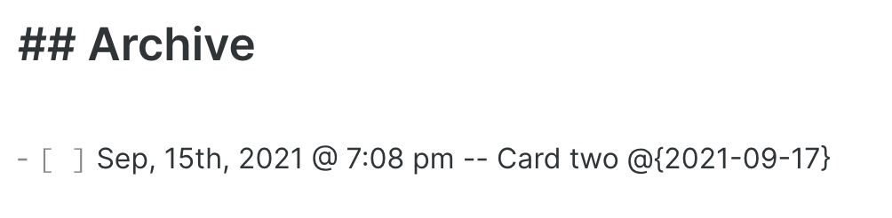

# Archive

See [Archive](../guide/archive.md) for how to archive and view cards.

## Add date and time to archived cards

Adds a timestamp to a card when it's archived, by default before the card's title:

Combine with the settings below to control its position, separator and format.

## Add archive date/time after card title

Places the archive timestamp after the card's title instead of before it.

## Archive date/time separator

The text used to separate the archive timestamp from the card's title.

## Archive date/time format

The [moment.js format](https://momentjs.com/docs/#/displaying/format/) used for the archive
timestamp. Defaults to the board's [date format](dates-and-time.md#date-format) and [time
format](dates-and-time.md#time-format) combined.

## Maximum number of archived cards

By default, a board's archive grows without limit. Set a number here to cap it — once the
archive reaches that many cards, the oldest ones are removed as new ones are added. `-1` (the
default) means no limit.
