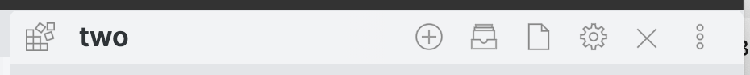
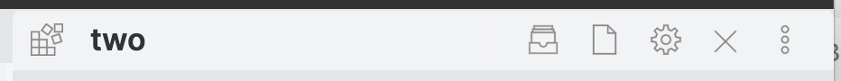

# Board header buttons

Hide any of the buttons shown in a board's header. All are on by default:

- **Add a list**
- **Archive completed cards**
- **Open as markdown**
- **Open board settings**
- **Search…**
- **Board view**

Default header:

With **Add a list** hidden:

