# Date & time

## Move dates to card footer

When on, dates are shown in the card's footer instead of inline in its body text.

## Date trigger

The character (or sequence of characters) that opens the [date
picker](../guide/dates-and-times.md#adding-a-date) while editing a card. Default: `@`.

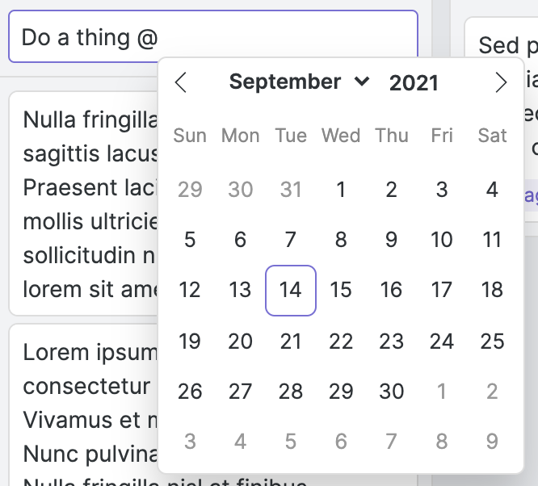

## Time trigger

The character (or sequence) that opens the [time
picker](../guide/dates-and-times.md#adding-a-time). Default: `@@`.

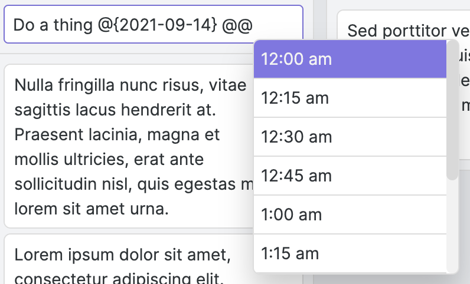

## Date format

The format a date is saved as in markdown. Uses [moment.js
tokens](https://momentjs.com/docs/#/displaying/format/).

`YYYY-MM-DD`:

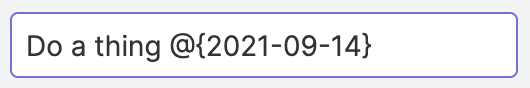

`ddd, MMM Do, YYYY`:

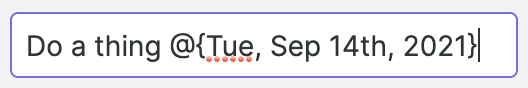

## Time format

The format a time is saved as. Uses [moment.js
tokens](https://momentjs.com/docs/#/displaying/format/).

`HH:mm`:

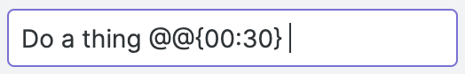

`h:mm a`:

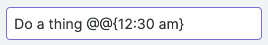

## Date display format

How a card's date is *shown*, independent of [Date format](#date-format) used to save it.

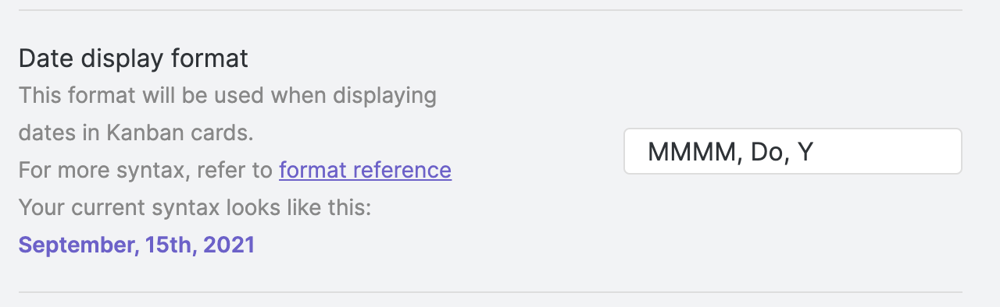

A card with a date in the current [Date format](#date-format):

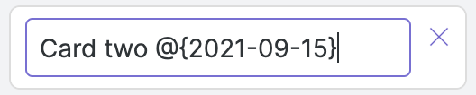

...shown using the display format:

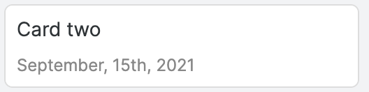

## Show relative date

Shows the distance between today and a card's date (e.g. "In 3 days", "A month ago") instead of
a fixed date. Not applied to dates from the Tasks and Dataview plugins.

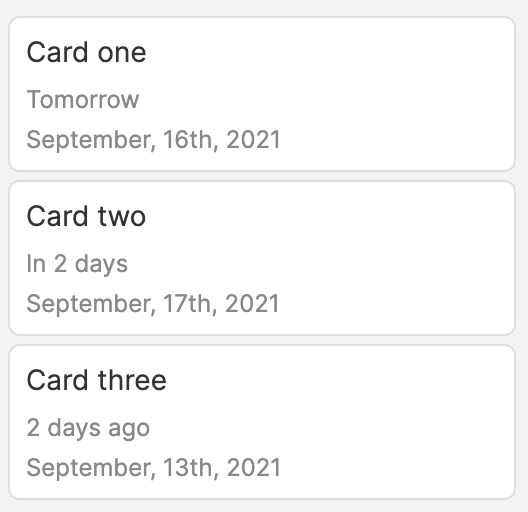

## Link dates to daily notes

Makes a card's date link to the matching daily note, e.g. `[[2021-04-26]]`.

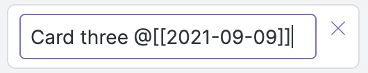
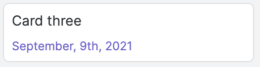

## Calendar: first day of week

Overrides which day the date picker's calendar starts each week on. Default: follows Obsidian's
own setting.
