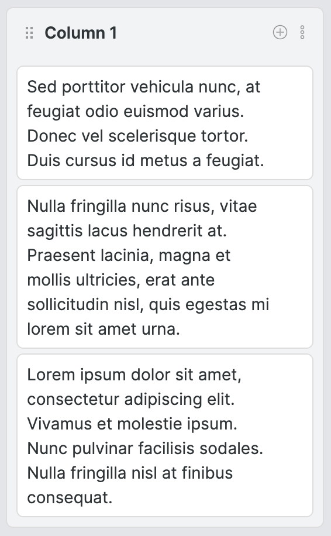
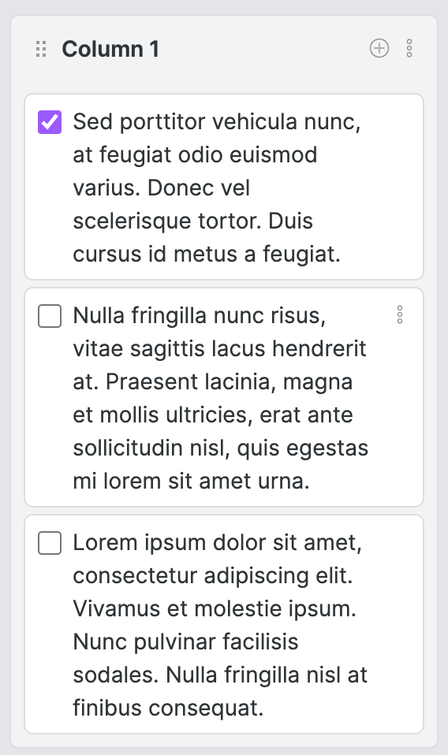
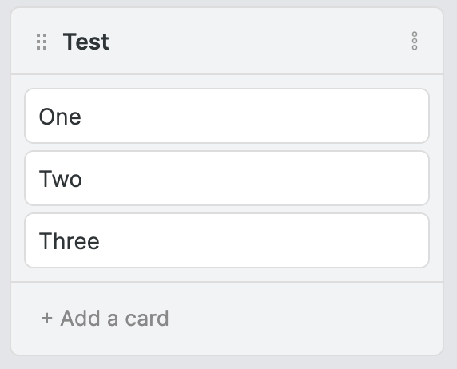
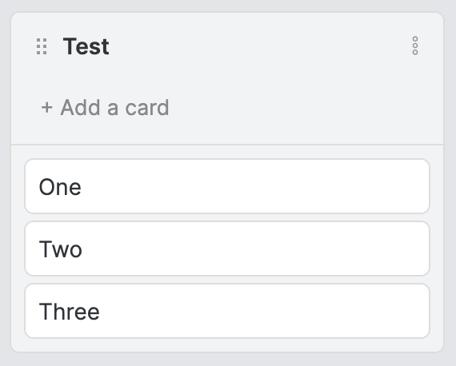
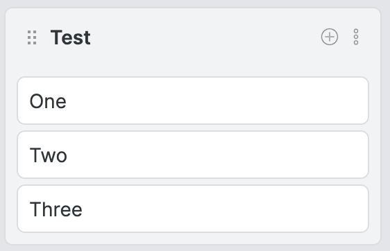
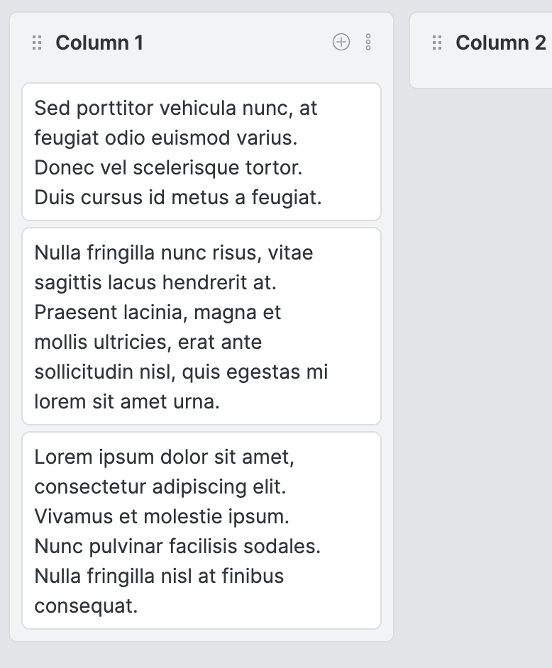
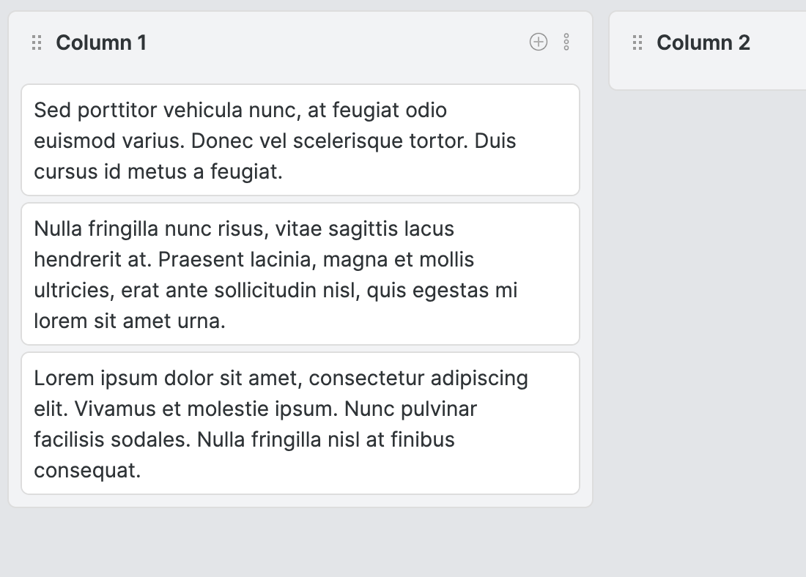
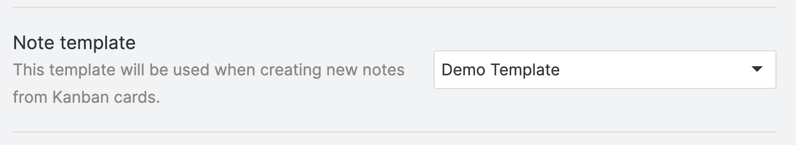
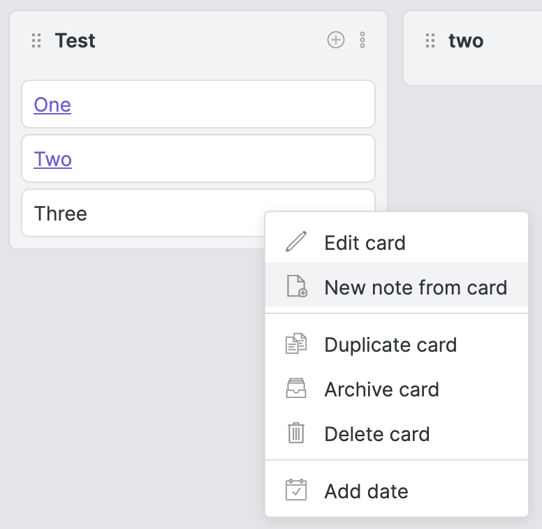
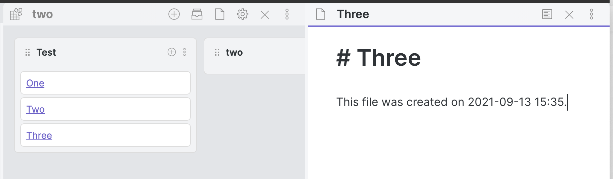

# General

## Card history

Records when cards are created, edited, moved, checked/unchecked and archived — see [Card
history](../guide/card-history.md). On by default; the history is kept in the board file, so
turning this off does not remove history already recorded.

## Display card checkbox

Shows a checkbox next to each card's title. `Ctrl`/`Cmd`-clicking it
[archives](../guide/archive.md) the card.

Off (default):



On:



## New line trigger

By default, `Enter` finishes editing a card or list and `Shift+Enter` adds a new line within it.
Turn this on to swap them: `Enter` adds a new line, `Shift+Enter` finishes editing.

## Prepend / append new cards

Controls where new cards are added to a list, and where the **Add a card** button sits.
Default: **Append**.

| Append | Prepend | Prepend (compact) |
|---|---|---|
|  |  |  |

## Hide card counts in list titles

Hides the card count that's otherwise shown next to each list's title.

## List width

Sets the width, in pixels, of a board's lists. Default: 272.



Set to 400:



## Expand lists to full width in list view

When on, lists fill the available width in [list view](../guide/views.md) instead of keeping a
fixed width.

## Note template

New notes created from a card (see [Creating a note from a
card](../guide/cards-and-lists.md#creating-a-note-from-a-card)) are pre-populated with this
template. Supports [Obsidian Templates](https://help.obsidian.md/Plugins/Templates) and
[Templater](https://silentvoid13.github.io/Templater/) syntax — see a [minimal
example](../assets/base-template.md) (rendered as a page here; copy its one line into your own
template note).

With the core Templates plugin active, create a template such as:

```
# {{title}}

This file was created on {{date}} {{time}}.
```

...then select it in the board's settings:





## Note folder

The folder new notes created from a card are placed in. Leave blank to use the vault's default
location for new notes.

## Maximum number of archived cards

See [Archive settings](archive.md#maximum-number-of-archived-cards).
