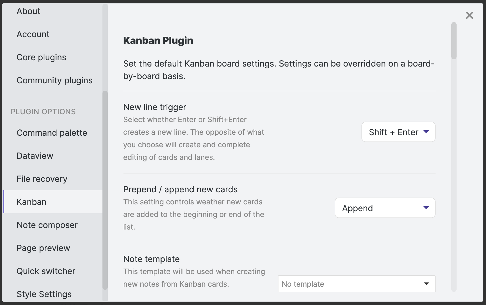
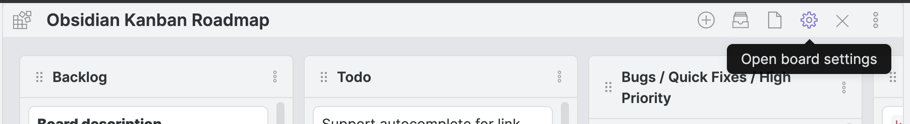
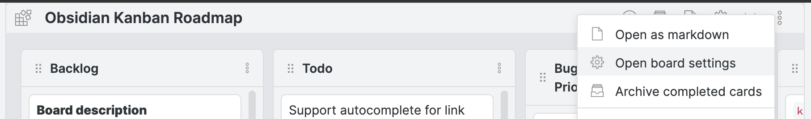

# Settings

Every setting below can be set **globally**, under **Settings → Kanban Starlane**:

...and **overridden per board**, from that board's settings — open it from the board's `⋮` menu
or its **Open board settings** header button:

A board setting left at its default follows the global value; changing it in the board settings
overrides the global value for that board only.

## Sections

- [General](general.md) — cards, lists, notes created from cards
- [Tags](tags.md)
- [Date & time](dates-and-time.md)
- [Archive](archive.md)
- [Inline metadata](inline-metadata.md) — Tasks and Dataview fields
- [Linked page metadata](linked-page-metadata.md)
- [Board header buttons](board-header-buttons.md)
- [Board color](board-color.md) — board-only, no global default
