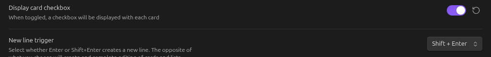
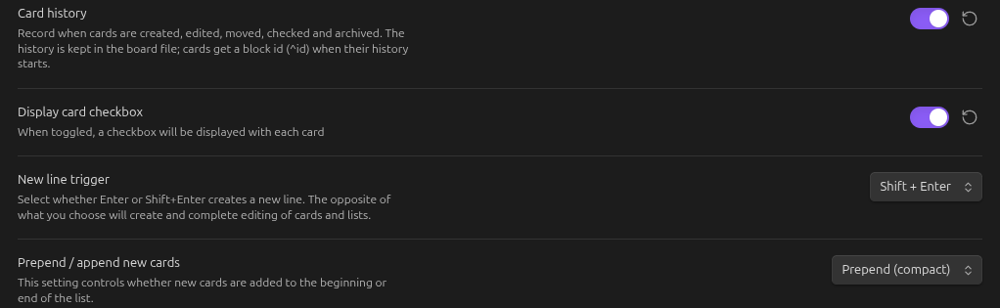
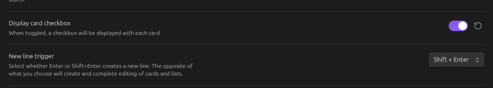

# Tags

## Move tags to card footer

When on, tags are shown in the card's footer instead of inline in its body text.

## Tag click action

Controls what clicking a tag on a card does:

- **Search Obsidian Vault** (default) — opens Obsidian's global search for that tag.
- **Search Kanban Board** — searches within the current board instead.

## Tag sort

Controls the order lists sort cards into when a tag-based sort is used. Add tags in the order
you want them to sort; cards without a listed tag sort after the ones that have one.

## Tag colors

Give specific tags a background and text color, shown wherever that tag appears on a card.

